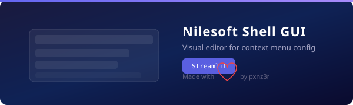

<div align="center">
  
</div>

## Prerequisites

- [Nilesoft Shell](https://github.com/moudey/shell) installed on Windows
  - Download the latest release, extract, and run `shell.exe /reg` to register the shell extension
- **Python 3.10+** with `streamlit` installed (`pip install streamlit`)

## Quick Start

```bat
git clone <your-repo-url>
cd nilesoft-shell-gui
streamlit run theme-tweaker.py
```

Opens at `http://localhost:8501`.

## Linking Config to Shell

For Nilesoft Shell to pick up your `.nss` files, they need to be in Shell's config directory. Two options:

**Option A - Copy** (simple): Copy all `.nss` files from this repo into your Shell install folder (where `shell.exe` lives).

**Option B - Symlink** (recommended for dev): Run as admin:
```bat
mklink /J "C:\Program Files\Nilesoft Shell\imports" "C:\full\path\to\repo\imports"
mklink "C:\Program Files\Nilesoft Shell\shell.nss" "C:\full\path\to\repo\shell.nss"
```

After any change: **Ctrl + right-click** desktop → **Shell → Update changes** (or restart Explorer).

> Set your Shell install path in the **Settings → Shell Installation Path** tab so the GUI can open `shell.log` for error checking.

## Features

| Tab | Purpose |
|-----|---------|
| **🎨 Theme** | Edit colors, gradient, font, border, shadow - 9 presets |
| **➕ Menu Items** | Add custom context menu entries (app, command, icon, conditions) |
| **🔄 Modify** | Hide, reorder, or move built-in system menu items |
| **⚙️ Settings** | Global Shell behavior (priority, delay, tooltips, exclude) |
| **📂 Imports** | View, toggle, and edit all `.nss` files inline |
| **🔎 Icon Browser** | Preview all built-in icons and SVG definitions |
| **🔧 Syntax Check** | Validate `.nss` files for mismatched braces/parens |
| **📜 History** | Auto-backups: restore any previous version |
| **📦 Export/Import** | Package your config as `.zip` |

## Project Structure

```
├── theme-tweaker.py         # Streamlit GUI
├── start.bat                # Launcher
├── shell.nss                # Main entry point
├── imports/
│   ├── theme.nss            # Visual theme
│   ├── modify.nss           # System item reordering
│   ├── custom.nss           # Your custom items
│   ├── images.nss           # SVG icons
│   ├── terminal.nss         # Terminal entries
│   ├── file-manage.nss      # File operations
│   ├── develop.nss          # Dev tools
│   ├── goto.nss             # Navigation shortcuts
│   └── taskbar.nss          # Taskbar items
├── AGENTS.md                # AI assistant context
└── SKILL.md                 # LLM skill instructions
```

## Docs

Detailed Nilesoft Shell reference docs in `Docs/`:
- [Getting Started](Docs/Get_started.md)
- [Syntax Rules](Docs/Configuration/Syntax_rules.md)
- [Themes](Docs/Configuration/themes.md)
- [Expressions](Docs/Expressions/expressions.md)
- [Examples](Docs/Examples/example1.md)

Or visit [nilesoft.org/docs](https://nilesoft.org/docs).

## License

This GUI project is MIT licensed. Nilesoft Shell itself is [MIT](LICENSE) by [moudey](https://github.com/moudey/shell).

---

Made with ❤️ by pxnz3r
